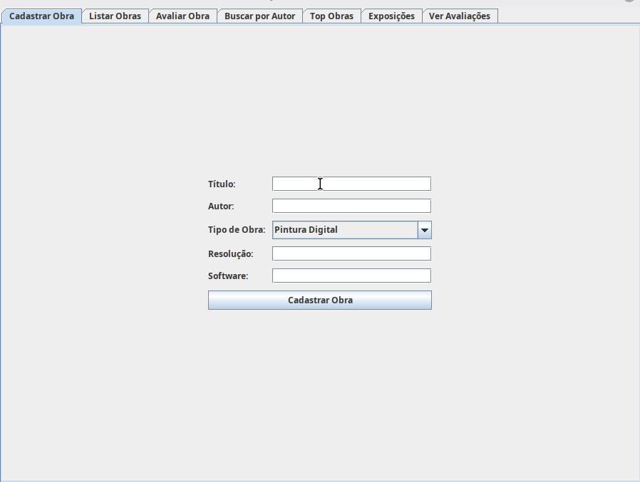
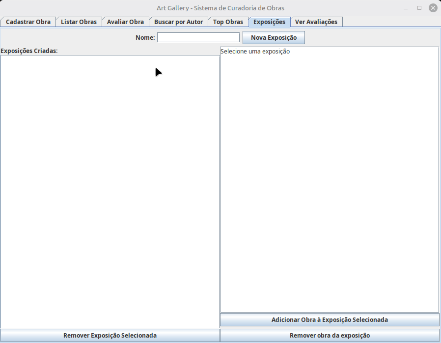
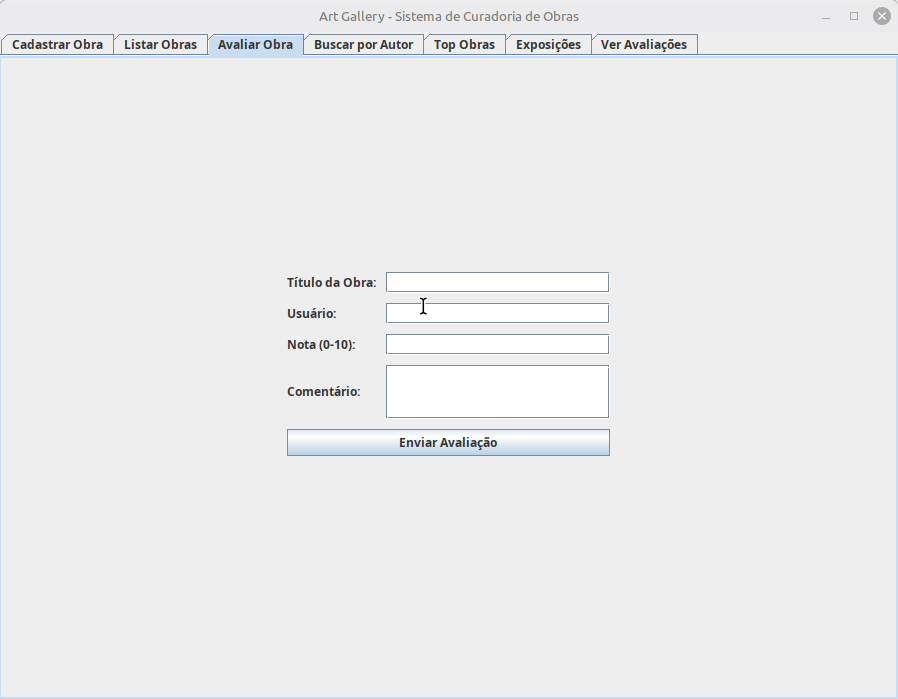
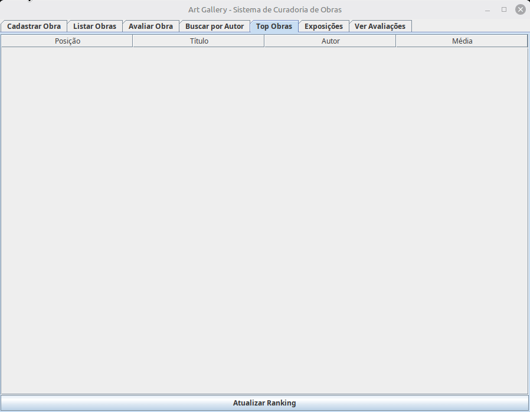

# 🎨 ArtGallery

Sistema desktop para gerenciamento e curadoria de obras de arte desenvolvido em **Java** como trabalho final da disciplina **Técnicas de Programação I**.

O sistema permite cadastrar obras, organizar exposições, registrar avaliações e calcular automaticamente um ranking das obras mais bem avaliadas.

Além das operações tradicionais de CRUD, o projeto implementa regras de negócio para gerenciamento de exposições e avaliações de obras.

---

# 🎬 Demonstração

Abaixo estão as principais funcionalidades do sistema.

## 🖼 Cadastro e Gerenciamento de Obras

<p align="center">
    
</p>

<p align="center">
Cadastro, edição e remoção de obras.
</p>

---

## 🏛 Gerenciamento de Exposições

<p align="center">
    
</p>

<p align="center">
Criação de exposições, adição e remoção de obras e exclusão de exposições.
</p>

---

## ⭐ Avaliações

<p align="center">
    
</p>

<p align="center">
Cadastro e atualização de avaliações das obras.
</p>

---

## 🏆 Ranking das Obras

<p align="center">
    
</p>

<p align="center">
Ranking automático das obras ordenadas pela média das avaliações.
</p>

---

# 🚀 Funcionalidades

## Obras

- ✅ Cadastrar obras
- ✅ Atualizar obras
- ✅ Remover obras
- ✅ Buscar obras por autor
- ✅ Avaliar obras
- ✅ Editar avaliações

## Exposições

- ✅ Criar exposições
- ✅ Adicionar obras às exposições
- ✅ Remover obras das exposições
- ✅ Listar obras presentes em cada exposição
- ✅ Remover exposições

## Ranking

- ✅ Cálculo automático da média das avaliações.
- ✅ Ranking das obras da maior para a menor média.

---

# 🏗 Arquitetura

O projeto foi organizado em camadas para separar responsabilidades.

```text
UI (Swing)
      │
      ▼
Service
      │
      ▼
Repository
      │
      ▼
PostgreSQL
```

Cada camada possui uma responsabilidade específica.

- **UI:** Interface gráfica do usuário.
- **Service:** Implementação das regras de negócio.
- **Repository:** Persistência e recuperação dos dados.
- **PostgreSQL:** Banco de dados da aplicação.

---

# 🛠 Tecnologias Utilizadas

- Java
- Java Swing
- PostgreSQL
- JDBC
- Git
- GitHub

---

# 💾 Persistência de Dados

A persistência dos dados é realizada utilizando **PostgreSQL** através do driver **JDBC**.

A classe `RepositoryObraDatabase` implementa a interface `Repository`, sendo responsável por toda comunicação com o banco de dados.

---

# 🐞 Desafio Técnico

Durante o desenvolvimento foi identificado um erro na funcionalidade de avaliação de obras.

## Problema

Ao avaliar novamente uma obra já avaliada, o sistema deveria apenas atualizar a avaliação existente.

Entretanto, uma nova avaliação era criada para a mesma obra e para o mesmo usuário.

## Investigação

O fluxo analisado foi:

```text
Botão "Avaliar"
        │
        ▼
avaliarObra()
        │
        ▼
buscar()
        │
        ▼
carregarAvaliacoes()
```

Foi adicionada uma instrução de depuração no início do método `carregarAvaliacoes()` para verificar o ID da obra recebido.

Resultado:

```text
ID da obra = 0
```

Como não existia nenhuma obra com ID igual a zero, nenhuma avaliação era encontrada e o sistema interpretava aquela avaliação como um novo cadastro.

Após um teste isolado do método `buscar()`, foi identificado que o objeto era reconstruído corretamente, porém seu ID não era atribuído.

## Solução

A solução consistiu em atribuir corretamente o ID ao objeto antes da chamada ao método `carregarAvaliacoes()`.

Após essa correção, o sistema passou a localizar corretamente avaliações existentes e atualizá-las, evitando registros duplicados.

---

# ▶️ Como Executar

## Pré-requisitos

- Java JDK 17 ou superior
- PostgreSQL
- Driver JDBC para PostgreSQL
- IDE Java (IntelliJ IDEA, Eclipse ou VS Code)

## Passos

1. Clone o repositório:

```bash
git clone 
```

2. Abra o projeto em sua IDE.

3. Configure o banco PostgreSQL e ajuste as credenciais de conexão, se necessário.

4. Certifique-se de que o driver JDBC está disponível no projeto.

5. Execute a classe principal da aplicação.

6. A interface gráfica será aberta automaticamente.

---

# 🧪 Como Testar

Após iniciar a aplicação, é possível testar as principais funcionalidades.

## Cadastro de Obras

- Cadastre uma nova obra.
- Verifique se ela aparece na listagem.

## Atualização

- Edite uma obra existente.
- Confirme se as alterações foram persistidas.

## Avaliações

- Avalie uma obra.
- Avalie novamente a mesma obra utilizando o mesmo usuário.
- Verifique se a avaliação anterior foi atualizada, e não duplicada.

## Exposições

- Crie uma exposição.
- Adicione obras.
- Remova obras.
- Exclua a exposição.

## Ranking

- Cadastre diferentes avaliações para várias obras.
- Consulte o ranking e verifique se as obras aparecem ordenadas pela média das notas.

---

# 🔮 Melhorias Futuras

- Implementação de testes automatizados utilizando JUnit.
- Validações adicionais para criação de exposições.
- Melhorias na interface gráfica.
- Novos filtros e consultas.

---

# 📚 Conceitos Aplicados

- Programação Orientada a Objetos
- Arquitetura em camadas
- JDBC
- PostgreSQL
- Modelagem de banco de dados
- CRUD
- Tratamento de exceções
- Depuração (Debug)
- Regras de negócio

---

# 👨‍💻 Autor

Desenvolvido por **Bruno Augusto de Paulo** como projeto final da disciplina **Técnicas de Programação I**.